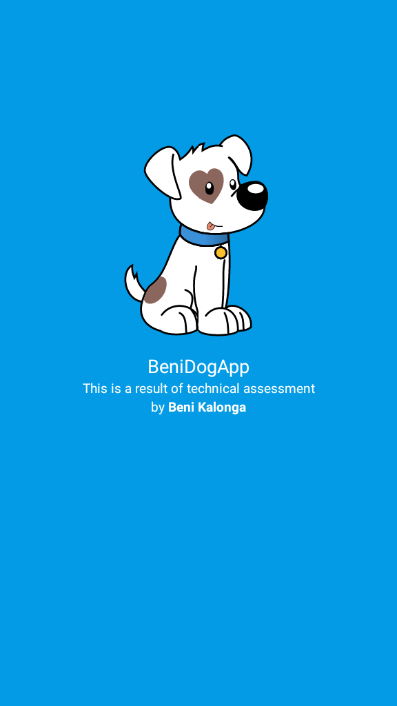
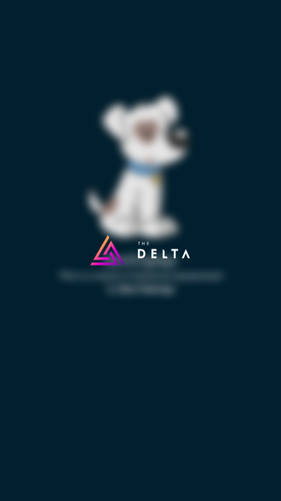
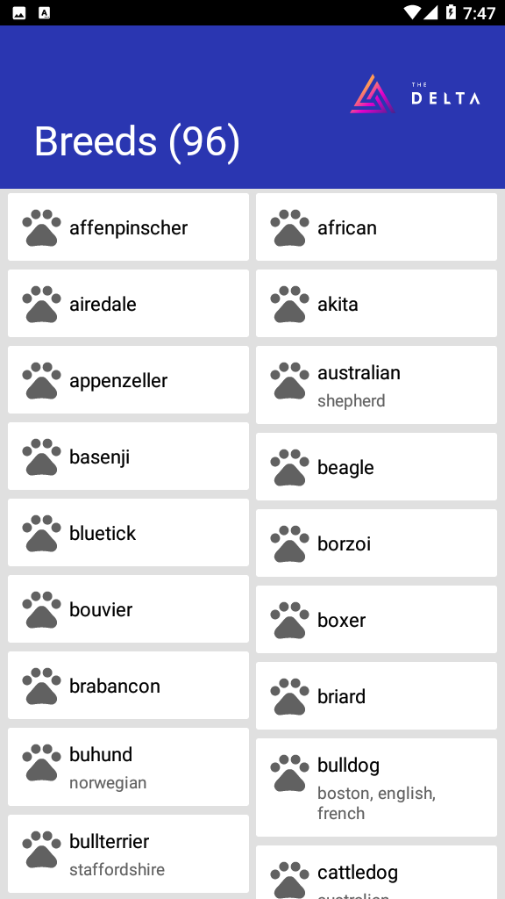
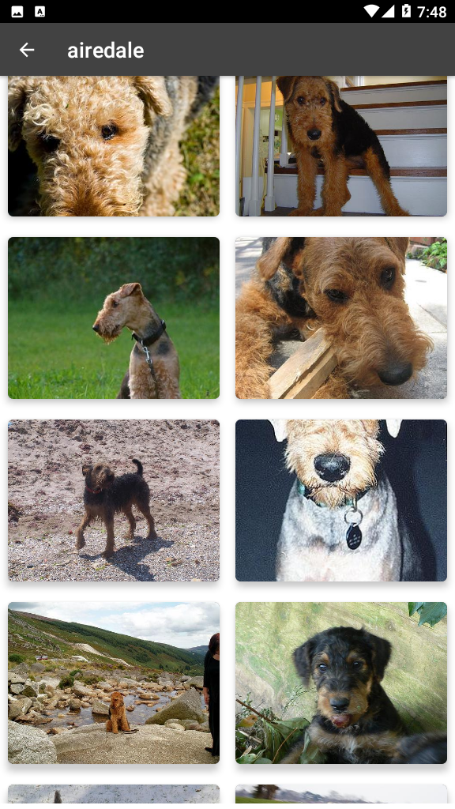
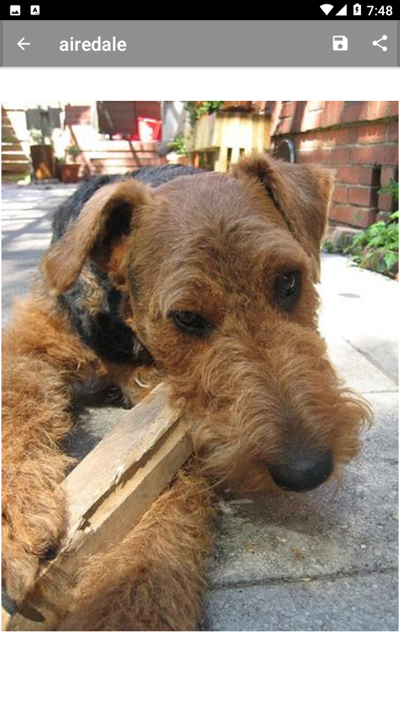
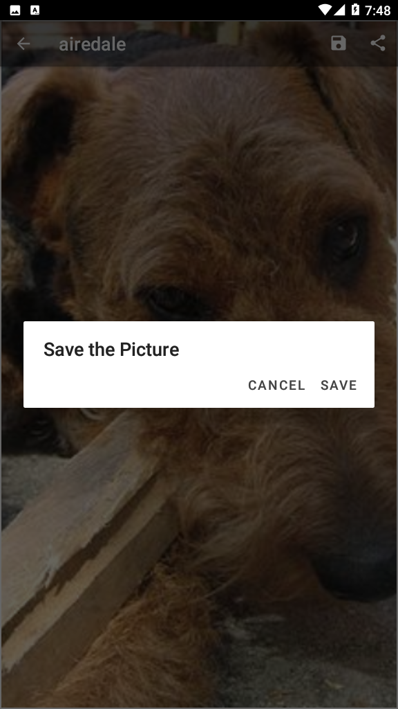
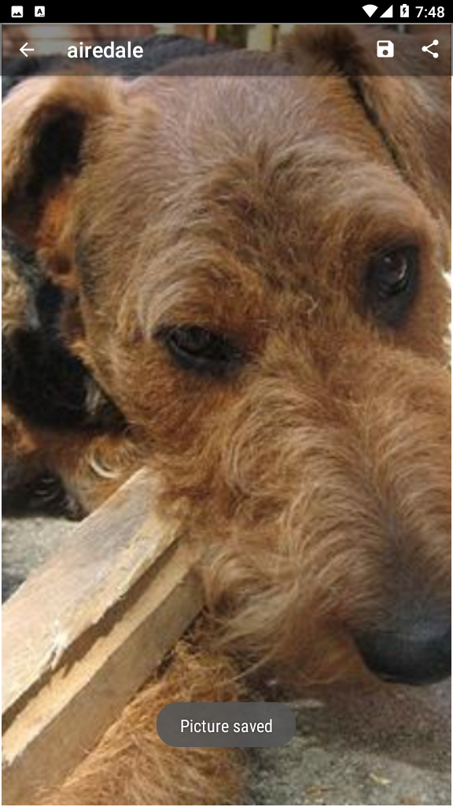
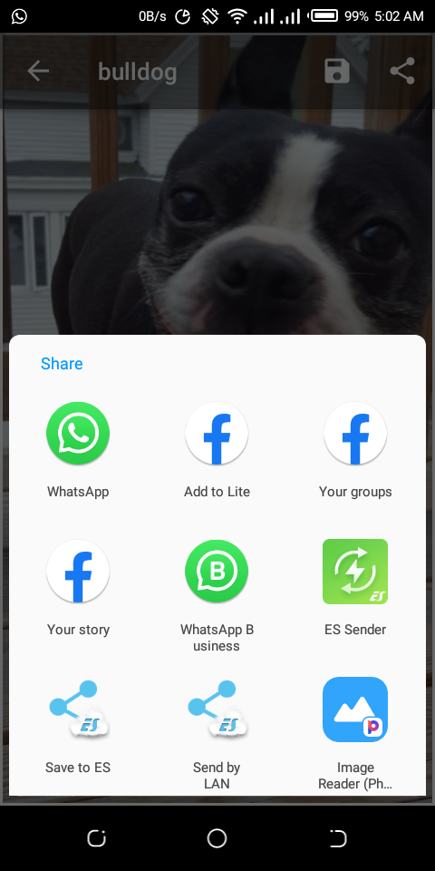

# BeniDogApiDemo
## by Beni Kalonga - Technical Assignment

Download apk file here [Dog Api Demo](apk/BeniDogApi.apk) 👍

https://user-images.githubusercontent.com/29547138/180584549-a34bd1db-2f5b-4e03-bc96-4463ef1dbd9f.mp4

# Depencies and Libraries
[In the Build.gradle file](app/build.gradle)

- [Retrofit](https://square.github.io/retrofit/) is a library layered atop of OkHttp that aims to simplify making REST-style Web service calls. You use annotations on a Java/Kotlin interface to describe the REST URLs that you wish to access, along with the HTTP operations to perform (e.g., GET, POST, PUT).
- [Glide](https://bumptech.github.io/glide/) According to me, Glide is a fast and efficient image loading library for Android focused on smooth scrolling. Glide offers an easy to use API, a performant and extensible resource decoding pipeline and automatic resource pooling
- [PhotoView](https://github.com/Baseflow/PhotoView) This library aims to keep the zooming implementation simple. If you are looking for an implementation that supports subsampling, 
- [PermissionX](https://github.com/guolindev/PermissionX) it is an extension Android library that makes Android runtime permission request extremely easy. You can use it for basic permission request occasions or handle more complex conditions, like showing rationale dialog or go to app settings for allowance manually.
- [Blurry](https://github.com/wasabeef/Blurry) This library helps to apply the blur effect on a view
- Genius UI & Res Generates resources such like colors and dimen with different values

# Architecture (MVVM)
### Model - View - ViewModel
MVVM architecture is a Model-View-ViewModel architecture that removes the tight coupling between each component. Most importantly, in this architecture, the children don't have the direct reference to the parent, they only have the reference by observables.
- Model: It represents the data and the business logic of the Android Application. It consists of the business logic - local and remote data source, model classes, repository.
- View: It consists of the UI Code(Activity, Fragment), XML. It sends the user action to the ViewModel but does not get the response back directly. To get the response, it has to subscribe to the observables which ViewModel exposes to it.
- ViewModel: It is a bridge between the View and Model(business logic). It does not have any clue which View has to use it as it does not have a direct reference to the View. So basically, the ViewModel should not be aware of the view who is interacting with. It interacts with the Model and exposes the observable that can be observed by the View.

# Jetpack components
- LiveData
- ModelView
- DataBinding
- Navigation UI
- Fragment
- Transition

# Bonus points
Pictures
- can be saved
- can be shared
- are continuously loading as the user scrolls down. (Infinite scrolling)

## Screenshots (Step by step)
 

  
  
  
  
  
  
  
  
 

